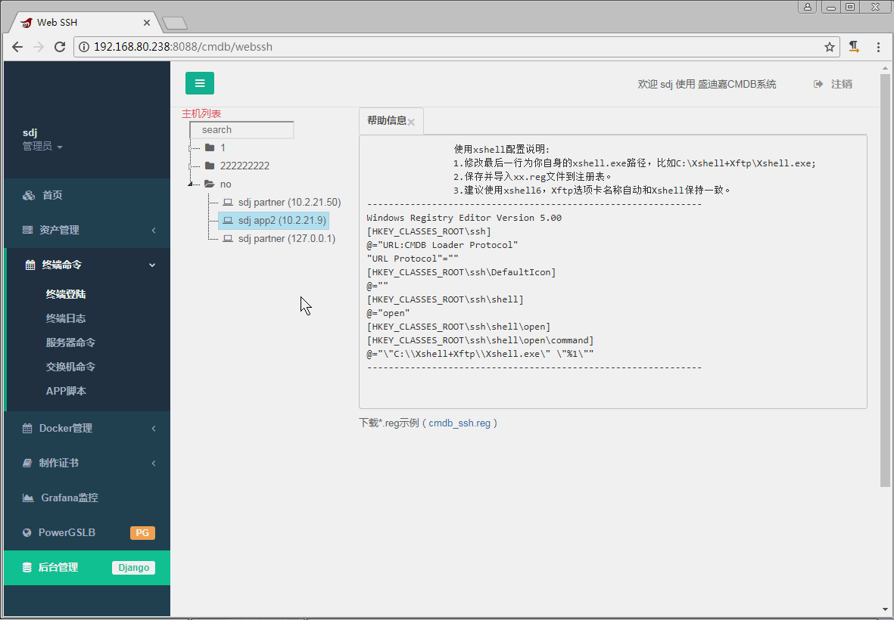
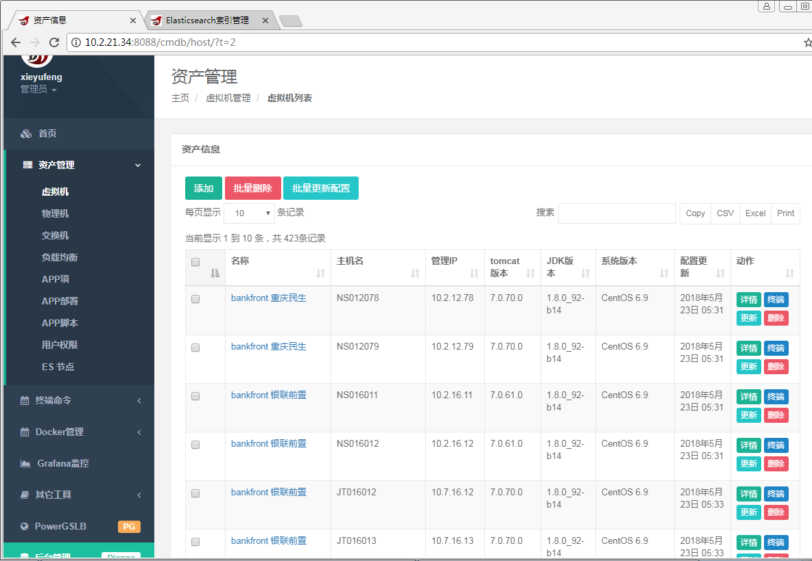
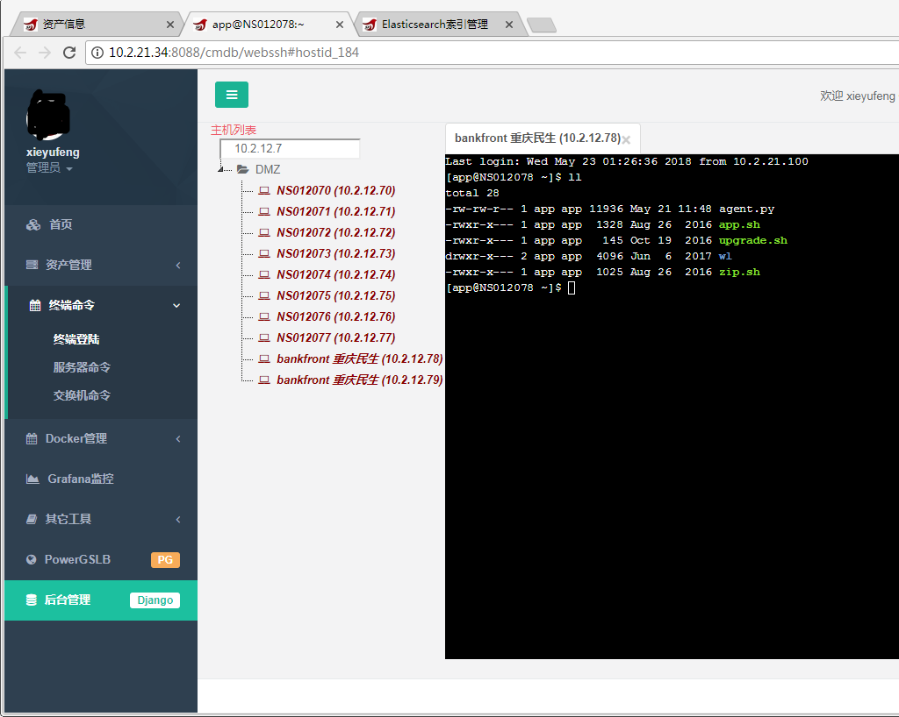
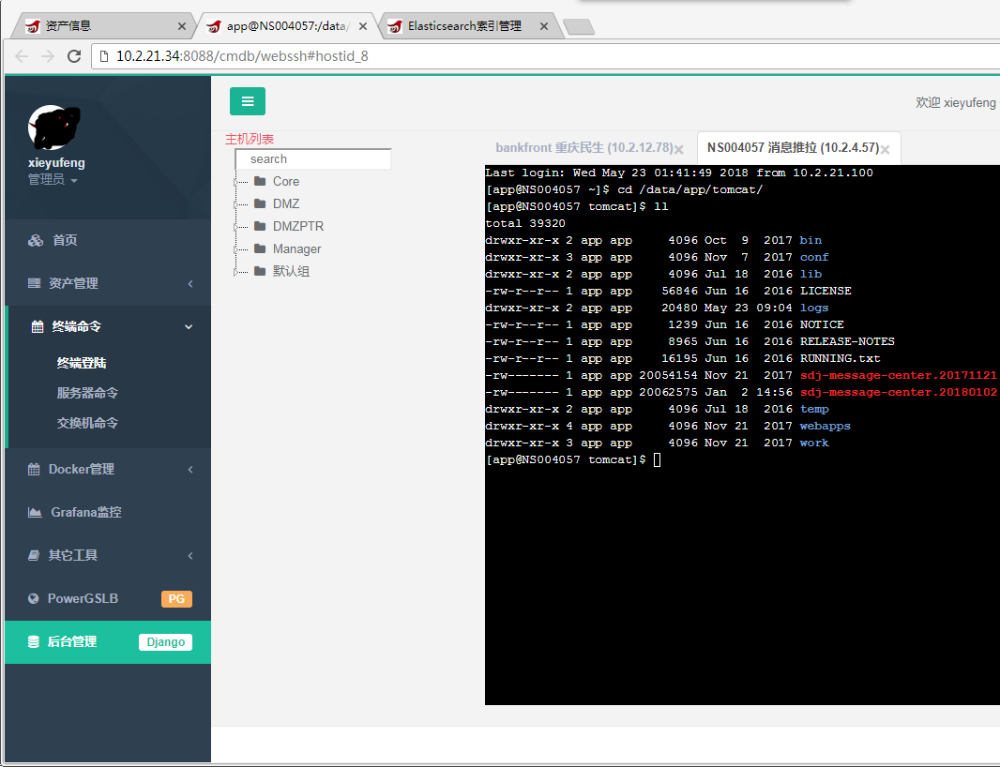
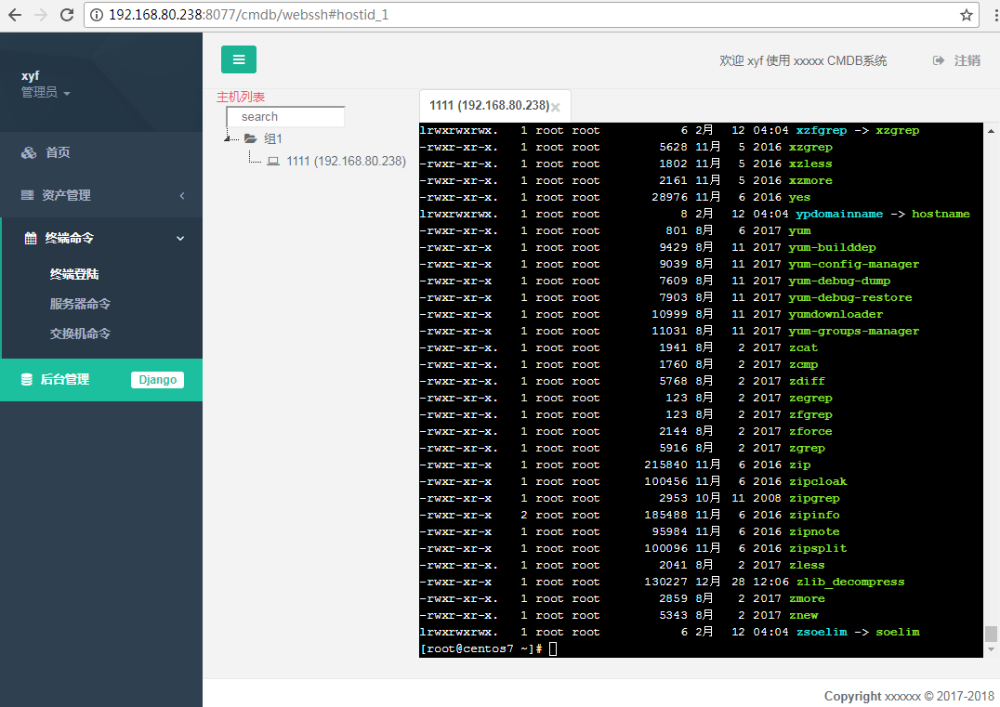
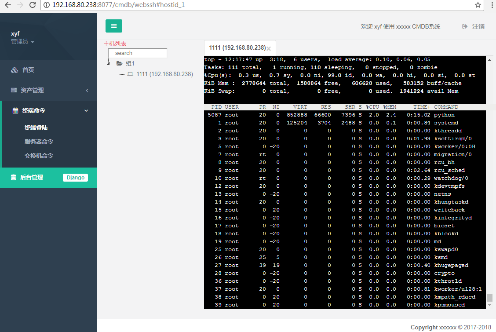
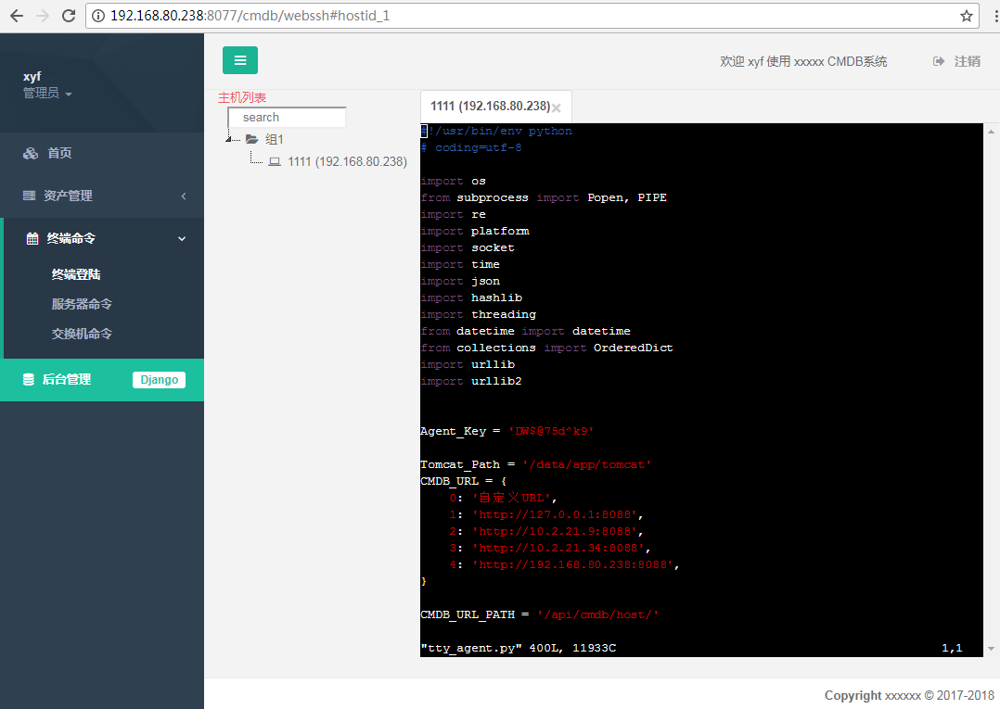

# 本项目已停止更新，和docker合并到另一项目中 
# [py2010/cmdb](https://github.com/py2010/cmdb)，更新支持软件终端。

# ---------------------  2019.01.04  -----------------------
# 通知：好久没更新了，年底吃饱了没事干时将更新一下，敬请期待
* 1.支持网页SFTP，文本编辑；
* 2.(增加堡垒机功能)支持软件终端，就是从可从网页直接跳转到xshell终端；当然也同时支持sftp，比如在xshell中点xftp就打开文件sftp管理。
因为个人习惯还是用xshell方便，网页中少了很多功能，比如不能用快捷键。此功能上月已在公司CMDB系统中开发完成。非常实用！！

# ---------------------  2019.01.04  -----------------------
# Django webssh
使用django的channels做为websocket后端
这个webssh项目是我开发CMDB项目中拆出一个webssh的功能，所以代码中可能有其它不相关的，懒得整理了。整个CMDB项目是去年开始开发的，以前就想放上来，但拆得麻烦所以一直没弄。
主要程序为cmdb/consumers.py interactive.py二个文件。

* 特色:
        整个网站都是django，http和websocket在同一端口，市面上其它cmdb多数是使用第三方websocket后端。
        其它该有的特色都有，比如终端彩色，包括vim等。echo $TERM

* 环境：
        centos7 python2.7,
        centos6系统应当也可以，以前都开始开发时就是在6上，python最好使用7，用6的话有些str.format()可能带{}报错需为{0}

* 搭建：
        
        1. 导入django MySQL数据库 xyf.sql；
        管理员xyf密码为xyf.2017
        登陆地址为django后台 http://ip:8088/admin/ ;
        我的原整个项目登陆地址为http://ip:8088/login 带有手机OPT等其它验证，改得麻烦，所以本webssh应当在/admin/登陆。

        2. 安装redis
        REDIS = ['127.0.0.1:6379', 'sdj2017']
        不想装redis，则修改settings.py，去掉CHANNEL_LAYERS中的redis BACKEND及其CONFIG
        CHANNEL_LAYERS = {
                "BACKEND": "asgiref.inmemory.ChannelLayer",  #开发环境中使用内存就可以了
                # "BACKEND": "asgi_ipc.IPCChannelLayer",       #daphne和runworker不在同一服务器时不支持
                "ROUTING": "webssh.routing.channel_routing",    # 定义channel的根入口
        }
        使用内存时，很容易超出一定字节数就溢出了。比如ll /bin/。所以生产环境应当用redis或ipc。
        
        3. 安装依赖组件requirements.txt
        有好多不需要，懒得整理了，因为我电脑上都有装，如果删掉一些也不清楚哪有没调用，不愿再用新机来安装测试。

        4. 启动网站
        cd 到项目根目录，执行c/d 8088启动网站，相当于python manage.py runserver 0.0.0.0:8088，脚本为c/d.sh，个人习惯常用命令放里面。
        生产启动时执行 c/d restart

        5. 访问网站
        http://ip:8088/cmdb/host
        对主机点终端，
        http://ip:8088/cmdb/webssh#hostid_1

